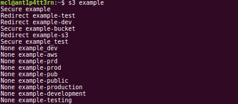
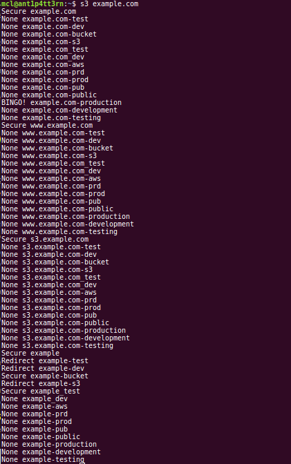

## Hunting for Insecure Amazon AWS S3 Buckets

Breaches caused by insecurely-configured Amazon S3 buckets are not new.  Researchers have been sounding the alarm [since 2013](https://blog.rapid7.com/2013/03/27/open-s3-buckets/).  However, S3-related breaches continue to make the news.  Last Friday (20170901), researchers announced the discovery of [records for four million Time Warner Cable customers](https://threatpost.com/four-million-time-warner-cable-records-left-on-misconfigured-aws-s3/127807/) due to an improperly secured Amazon S3 bucket.

Amazon has been proactive in raising awareness of this issue.  However, the problem persists, and is widespread.

Let's be clear:  The problem here isn't just one of potential exposure of PII.  The `amazonaws.com` domain, which is used to access files stored in S3, is often allowed through firewalls and proxies.  A publicly-accessible bucket doesn't just provide attackers with the ability to copy files from the bucket.  It also allows for the modification of existing files, or the uploading of new files.

This presents two dangers:  First, it appears that some web content is hosted or staged in S3.  If an attacker can modify this content, he can introduce malicious code, change the content of websites, etc.  Second, given the trust shown to the `amazonaws.com` domain, an attacker could conceivably host malware in a vulnerable S3 bucket and leverage it during a phishing campaign, use it as a staging area for attacks, and so forth.

Further, it's not enough that you secure your S3 buckets.  If your bucket was publicly-accessible at one point, it's likely cached or archived.   As Rapid7 points out in the above-referenced article, Google dorks such as:

```
site:s3.amazonaws.com filetype:xls password
```

work just fine, even if the bucket is currently secure.  Other archival sites would similarly have copies of data from your once-public bucket as well.


To facilitate my own research, and to help assess the exposure of clients, I developed and made [available from GitHub](https://github.com/treebuilder/s3-mining.git) some simple python code designed to take a string or domain as input and perform a check to determine the status of the S3 bucket.

##### Example 1: Working with strings
In the image below, I am checking for the existence of an S3 bucket named `example`.  The code checks that exact string, and several variants, and returns lines containing the result followed by the string tested.

Possible results are:

 - None: The bucket doesn't exist
 - Secure: The bucket exists, but is inaccessible
 - Redirect: The bucket exists, but refers us to a different URL
 - BadName: The name violates Amazon's restrictions
 - BINGO!: The bucket exists and is publicly accessible



The code will only check for variants if a non-404 status is returned.  I tested it with and without this restriction, and the number of buckets that exist in variant form when the base string doesn't exist is so small as to make this not worth the time necessary to perform the checks, particularly when checking against large lists.

##### Example 2: Working with domains
In the next image, I use the code to check for the existence of buckets based on the `example.com` domain.  As you can see, the output is a bit longer, because the code performs some additional transformations, including:

 - Checking for the string represented by the leftmost label of the domain
 - Checking for the existence of a bucket based on certain subdomains (`www` and `s3`)
 - Checking for variants as above



As you can see, we are successful:  `example.com-production` exists and is publicly accessible.  Were we to install the awscli toolkit via `pip install awscli --upgrade --user`, we could then manipulate the data found there.

##### Typical usage

In practice, I use the tool to cycle through a list of domain names for which a client is responsible, to determine whether any relevant buckets exist, and whether they're accessible.  However, the tool could also be used to programmatically monitor the status of one or more buckets and alert when that status changes.

The code is by no means complex.  But it is certainly useful.  One could feed it, say, the top thousand or so names from the `Alexa Top 1 Million` list, and work with any exposed organizations to help them secure their data.  One could also proactively scan their web proxy logs or DNS query logs for S3-related traffic, extract names, and perform checks to ensure the buckets in use in your environment are properly secured.

##### Other resources

I've written two blog posts on the topic.  The first one is [here](https://justhackerthings.com/post/hunting-for-insecure-amazon-s3-buckets/), and the second is [here](https://justhackerthings.com/post/amazon-aws-insecure-s3-buckets-redux/).
